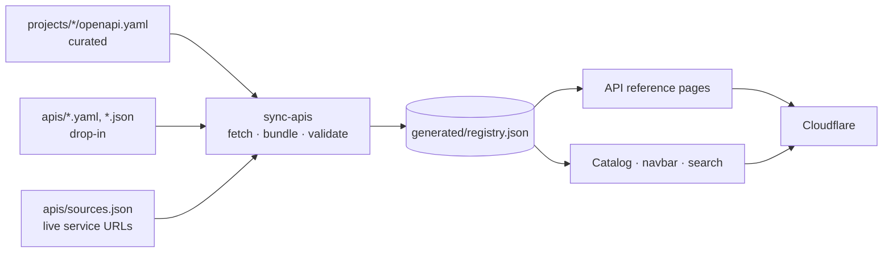

# Auto-documenting existing APIs

Every API with an OpenAPI (or Swagger 2.0) spec is documented automatically — no Markdown, sidebar or config changes. `npm run sync` (part of every build) discovers specs from three sources, bundles them, and generates the API reference, catalog entry, search index and navigation.



| Source | Use when | What to add |
|---|---|---|
| **Live service** | The API already serves its spec (SpringDoc `/v3/api-docs`, FastAPI `/openapi.json`, ASP.NET Swashbuckle `/swagger/v1/swagger.json`, API gateway export, raw Git URL) | An entry in `apis/sources.json` |
| **Drop-in file** | The spec lives elsewhere and is copied/pushed here by CI | `apis/<id>.yaml` or `apis/<id>.json` |
| **Curated project** | The team also writes guides | `projects/<id>/openapi.yaml` + `projects/<id>/docs/` + registry entry |

## Live services — `apis/sources.json`

```json
[
  {
    "id": "mortgages",
    "url": "https://mortgages.internal.meridian.example/v3/api-docs",
    "headers": { "Authorization": "Bearer ${SPEC_FETCH_TOKEN}" }
  },
  {
    "id": "branch-locator",
    "url": "https://raw.githubusercontent.com/meridian/branch-locator/main/openapi.yaml",
    "headers": { "Authorization": "token ${GITHUB_TOKEN}" },
    "optional": true
  }
]
```

- `${VAR}` is substituted from environment variables (CI secrets) — never commit credentials.
- A failing fetch fails the build unless `"optional": true`, in which case the API is skipped with a warning.
- The spec must be self-contained (no relative `$ref`s to other files).

## Metadata

Portal metadata (domain, owner, status, dependencies) is taken from the spec so owning teams control it in code:

```yaml
info:
  title: Lending Origination API       # → display name ("API" suffix dropped)
  version: 0.9.0                      # → version badge
  description: First paragraph…       # → card summary
  contact: { name: Lending Squad }    # → owner
  x-meridian:
    domain: Retail Lending
    status: Beta
    dependsOn: [kyc, accounts]        # → service map + cards; validated
```

A curated `projects/projects.json` entry overrides these values.

## Keeping docs current

The CI workflow rebuilds and redeploys:

- on every push to the portal,
- **nightly** (picks up changes in live service specs),
- on a `repository_dispatch` event of type `api-changed`, which any API's pipeline can send after deploying:

```bash
curl -X POST https://api.github.com/repos/mdav43/pimcoplates/dispatches \
  -H "Authorization: Bearer $PORTAL_TOKEN" \
  -d '{"event_type":"api-changed","client_payload":{"api":"mortgages"}}'
```

## Quality gates

The build fails on: unreachable required specs, invalid OpenAPI, unknown `dependsOn` ids, broken links, and `<ApiRef>` references to operations that no longer exist. Missing `operationId`s produce a warning (doc URLs then derive from the summary and are less stable).
