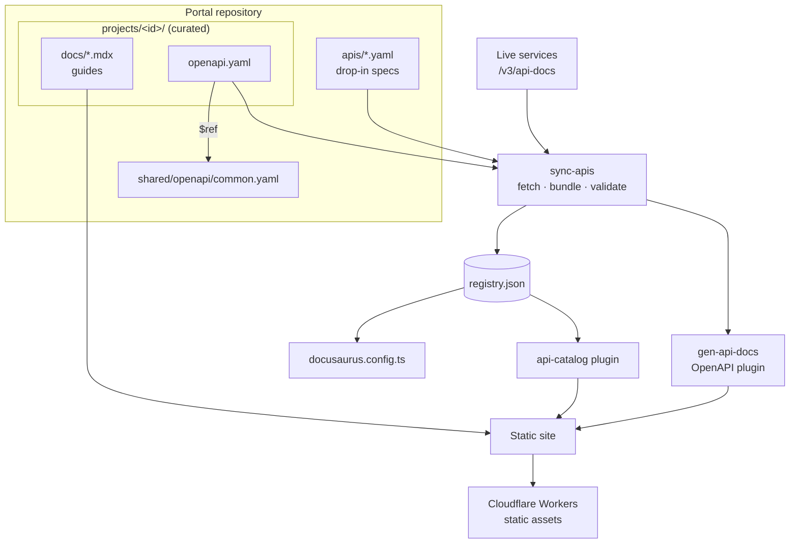

# Meridian Developer Portal

This portal demonstrates **Docusaurus as the backbone for bank-wide documentation**: every existing API is **auto-documented from its OpenAPI spec** (pulled from files or live services), teams can layer hand-written guides on top, and the portal stitches it all into one searchable, cross-linked site deployed to Cloudflare. See [Auto-documenting APIs](./auto-documentation.md).

## How it fits together

| Capability | How it is delivered |
|---|---|
| Auto-documentation | Any OpenAPI spec — file or live URL — becomes a full API section with no extra files |
| Multi-project | One `plugin-content-docs` instance per project (`/payments`, `/accounts`, …) with its own sidebar and versioning |
| OpenAPI reference | `docusaurus-plugin-openapi-docs` renders each spec with an interactive *try it* panel |
| Shared contracts | Common schemas (`Money`, `AccountRef`, `PartyRef`, `Problem`) live in one file and are `$ref`'d by every spec |
| Cross-project links | `<ApiRef>` / `<SchemaRef>` resolve against the catalog at build time and fail the build if broken |
| Discovery | [API Catalog](/catalog), offline full-text search, service map |
| Hosting | Static build served by Cloudflare (see [Deploy to Cloudflare](./deploy-cloudflare.md)) |

## APIs

<ProjectCards />
