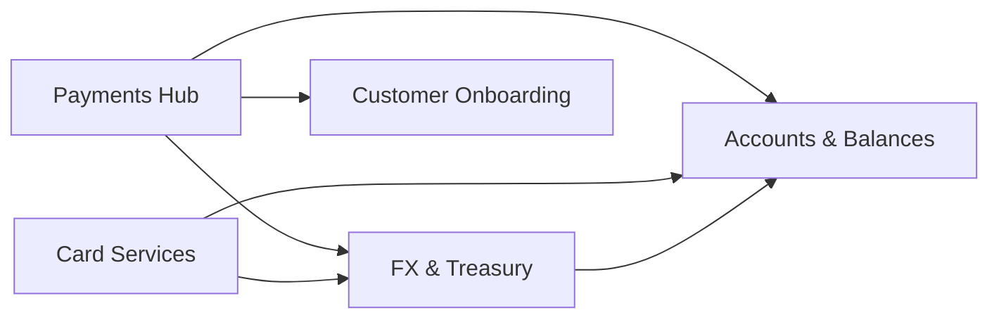

# Service map

Dependencies declared in `projects/projects.json` (`dependsOn`) and documented in each project's *Cross-project integrations* page.

## Canonical identifiers

| Identifier | Owner | Consumers |
|---|---|---|
| `AccountRef` | <ApiRef project="accounts" op="getAccount" /> | Payments, Cards, FX |
| `PartyRef` | <ApiRef project="kyc" op="getParty" /> | Accounts, Payments, Cards |
| `fxQuoteId` | <ApiRef project="fx" op="createQuote" /> | Payments |
