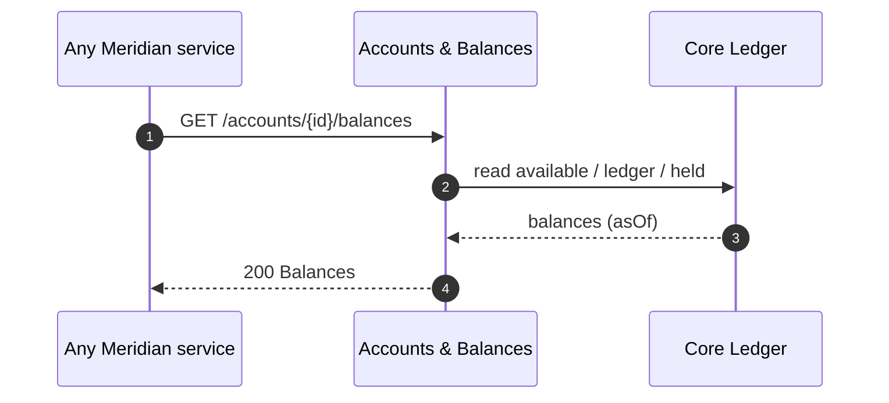

# Accounts & Balances

:::info Project facts
**Domain:** Core Banking · **Owner:** Core Ledger Team · **Status:** GA · **Version:** v3.1.0
:::

Accounts & Balances is the **system of record** for deposit accounts. It owns the canonical `AccountRef` schema that every other Meridian API uses to point at an account.

## At a glance

| | |
|---|---|
| **Depends on** | None |
| **Consumed by** | [Payments Hub](/payments/intro), [Card Services](/cards/intro), [FX & Treasury](/fx/intro) |
| **Spec** | [Download OpenAPI (bundled)](pathname:///openapi/accounts.yaml) |
| **Reference** | [API Reference](/accounts/api) |

## Operations

Rendered live from `projects/accounts/openapi.yaml`:

<OperationTable project="accounts" />

## Key flow

