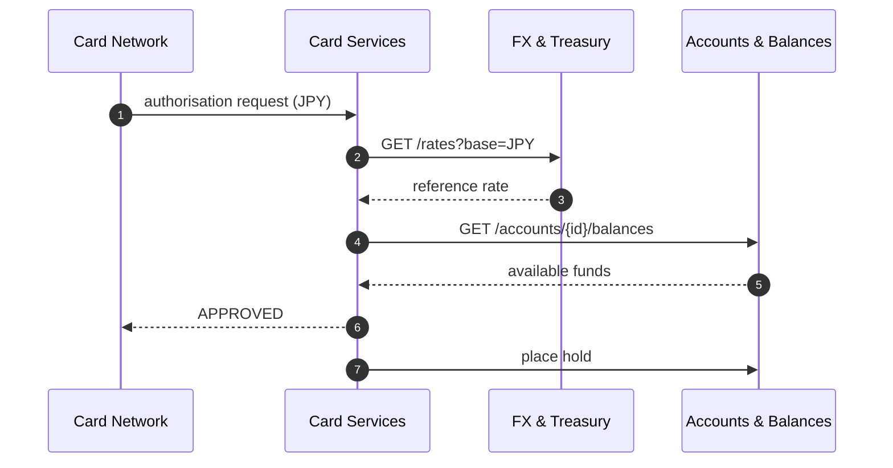

# Card Services

:::info Project facts
**Domain:** Consumer Banking · **Owner:** Cards Engineering · **Status:** GA · **Version:** v1.8.0
:::

Card Services manages the full card lifecycle — issuance, activation, freezing, limits — and exposes the authorisation stream for each card.

## At a glance

| | |
|---|---|
| **Depends on** | [Accounts & Balances](/accounts/intro), [FX & Treasury](/fx/intro) |
| **Consumed by** | None |
| **Spec** | [Download OpenAPI (bundled)](pathname:///openapi/cards.yaml) |
| **Reference** | [API Reference](/cards/api) |

## Operations

Rendered live from `projects/cards/openapi.yaml`:

<OperationTable project="cards" />

## Key flow

