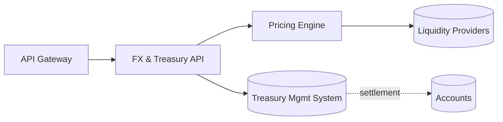

# Architecture

## Non-functional characteristics

| Attribute | Target |
|---|---|
| Availability | 99.95% monthly |
| p99 latency (reads) | < 150 ms |
| p99 latency (writes) | < 400 ms |
| Data residency | Primary: us-east · DR: us-west |
| Classification | Confidential – customer data |
