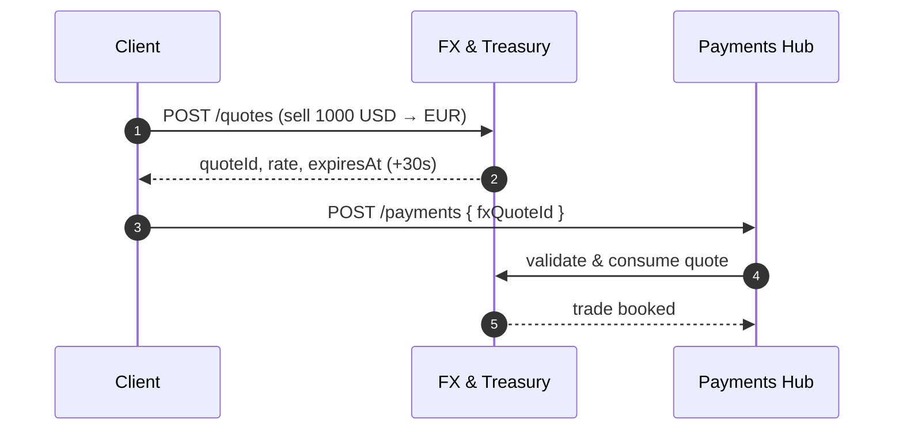

# FX & Treasury

:::info Project facts
**Domain:** Markets · **Owner:** Treasury Technology · **Status:** Beta · **Version:** v1.2.0-beta
:::

FX & Treasury provides indicative rates, executable quotes and trade booking. **Status: Beta** — breaking changes are possible before 2.0.

## At a glance

| | |
|---|---|
| **Depends on** | [Accounts & Balances](/accounts/intro) |
| **Consumed by** | [Payments Hub](/payments/intro), [Card Services](/cards/intro) |
| **Spec** | [Download OpenAPI (bundled)](pathname:///openapi/fx.yaml) |
| **Reference** | [API Reference](/fx/api) |

## Operations

Rendered live from `projects/fx/openapi.yaml`:

<OperationTable project="fx" />

## Key flow

