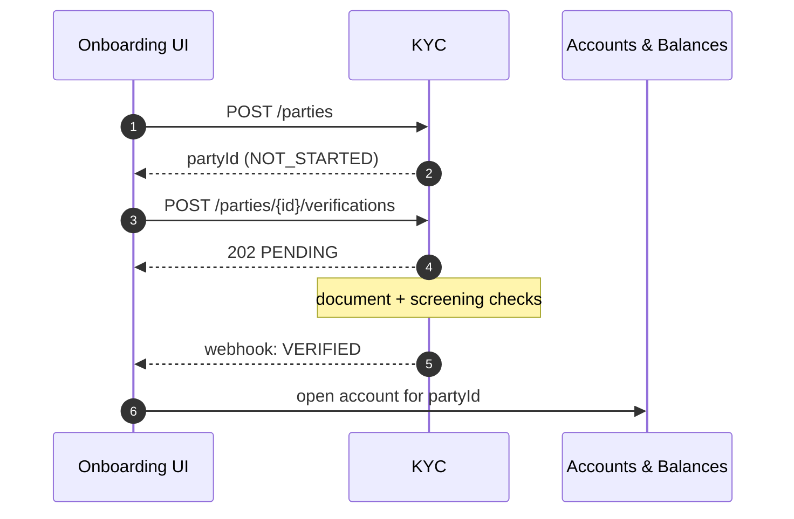

# Customer Onboarding (KYC)

:::info Project facts
**Domain:** Risk & Compliance · **Owner:** Financial Crime Engineering · **Status:** GA · **Version:** v2.0.0
:::

Customer Onboarding (KYC) creates and verifies parties and runs sanctions/PEP screening. It owns the canonical `PartyRef` used across the bank.

## At a glance

| | |
|---|---|
| **Depends on** | None |
| **Consumed by** | [Payments Hub](/payments/intro) |
| **Spec** | [Download OpenAPI (bundled)](pathname:///openapi/kyc.yaml) |
| **Reference** | [API Reference](/kyc/api) |

## Operations

Rendered live from `projects/kyc/openapi.yaml`:

<OperationTable project="kyc" />

## Key flow

