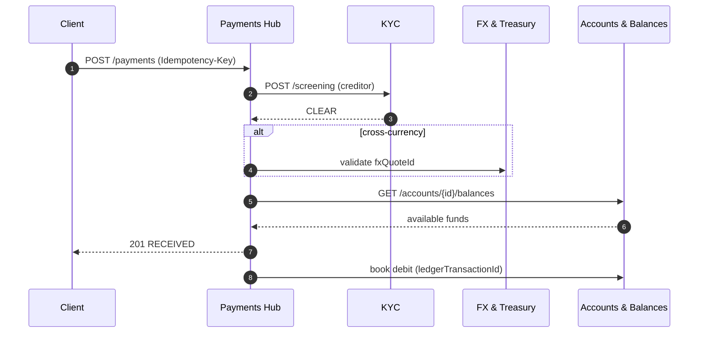

# Payments Hub

:::info Project facts
**Domain:** Transaction Banking · **Owner:** Payments Platform Team · **Status:** GA · **Version:** v2.4.0
:::

Payments Hub is the single entry point for moving money at Meridian. Channels (online banking, treasury portals, host-to-host) call one API; the hub validates, screens, routes and books the payment on the correct rail.

**Rails supported:** ACH, Fedwire, SEPA Credit Transfer, SEPA Instant, SWIFT gpi.

## At a glance

| | |
|---|---|
| **Depends on** | [Accounts & Balances](/accounts/intro), [FX & Treasury](/fx/intro), [Customer Onboarding (KYC)](/kyc/intro) |
| **Consumed by** | None |
| **Spec** | [Download OpenAPI (bundled)](pathname:///openapi/payments.yaml) |
| **Reference** | [API Reference](/payments/api) |

## Operations

Rendered live from `projects/payments/openapi.yaml`:

<OperationTable project="payments" />

## Key flow

